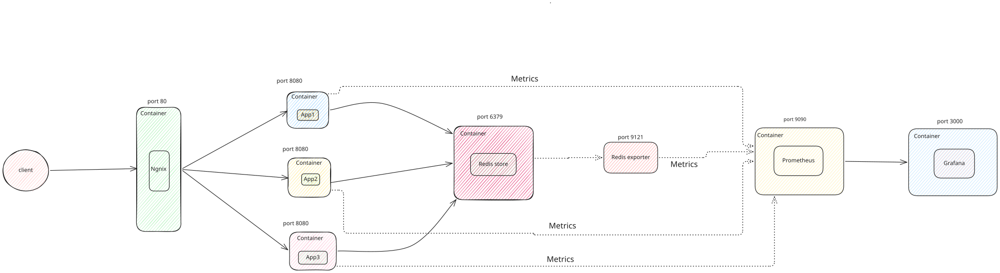
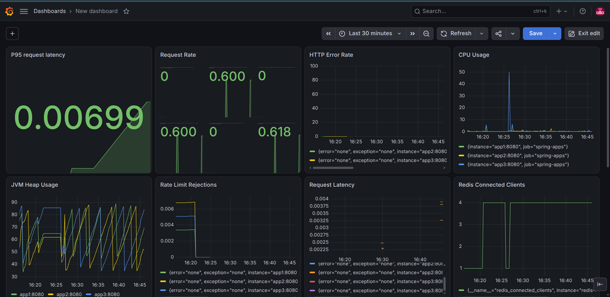
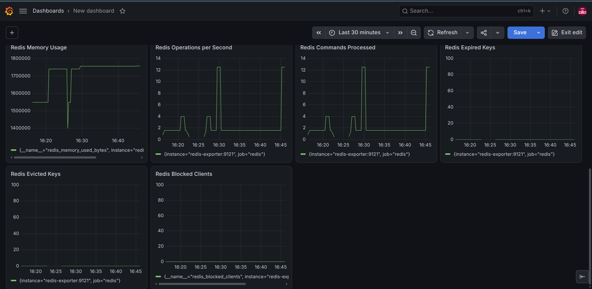

# Distributed Rate Limiter

A distributed, per-user rate limiter built with **Java 21, Spring Boot,
Redis, and Lua scripting**. The project demonstrates how multiple
application instances can enforce a shared rate limit using Redis as the
common state store, with Nginx distributing incoming requests and
Prometheus/Grafana providing observability.

> **Project status:** Core token-bucket logic, Redis-backed atomic rate
> limiting, per-user keys, multi-instance deployment, and monitoring
> have been implemented. Redis outage handling and formal load testing
> are planned follow-up work; do not treat performance figures as
> benchmark results until measured under controlled conditions.

## Architecture



Every application instance executes the rate-limit Lua script against
the same Redis store. Because Redis executes a Lua script atomically,
the read--calculate--write operation for a bucket is not interleaved
with another request's script. This lets the instances share rate-limit
state rather than maintaining separate in-memory buckets.

## Features

-   **Token Bucket algorithm** with configurable capacity and refill
    rate.
-   **Per-user rate limits** using the `X-User-Id` request header.
-   **Atomic Redis updates** through a Lua script.
-   **Shared state across three Spring Boot instances**.
-   **Nginx reverse proxy/load balancing** in front of the application
    instances.
-   **HTTP responses**: `200 OK` when a request is allowed and
    `429 Too Many Requests` when the bucket has no token.
-   **Metrics and dashboards** using Spring Boot Actuator, Micrometer,
    Prometheus, Grafana, and Redis Exporter.
-   **Containerized local environment** using Docker and Docker Compose.

## Technology Stack

Area                  Technologies
  --------------------- ----------------------------------
Language/runtime      Java 21
Application           Spring Boot, Spring Web
Rate limiting/state   Redis, Spring Data Redis, Lua
Traffic routing       Nginx
Containers            Docker, Docker Compose
Application metrics   Spring Boot Actuator, Micrometer
Monitoring            Prometheus, Grafana
Redis metrics         Redis Exporter
Build                 Maven

## Rate-Limiting Configuration

The current bucket configuration is:

Setting                                    Value
  ------------------- ----------------------------
Bucket capacity                        50 tokens
Refill rate                      2 tokens/second
Bucket scope                            Per user
Redis key pattern     `rate_limit:user:<userId>`

A new user's bucket starts at capacity. Each allowed request consumes
one token. Tokens are replenished over time up to the configured
capacity. When fewer than one token is available, the request is
rejected with HTTP `429`.

## API

### `GET /api/rate-limiter/response`

Checks the rate limit for the user identified by `X-User-Id`.

**Example request**

``` bash
curl -i \
  -H "X-User-Id: user-123" \
  http://localhost:8080/api/rate-limiter/response
```

**Example allowed response**

``` http
HTTP/1.1 200 OK
Content-Type: application/json
```

``` json
{
  "limit": 50,
  "remainingTokens": 49.0,
  "requestAllowed": true
}
```

**Example rejected response**

When the user's bucket is exhausted, the endpoint returns HTTP
`429 Too Many Requests` with a response body indicating that the request
was not allowed.

> Send the same `X-User-Id` on each request to consume the same bucket.
> A different user ID maps to a different Redis key and therefore a
> separate bucket. 

### Other endpoint

-   `GET /api/rate-limiter/limit-rate` --- rate-limit endpoint used
    during development/testing.

Use the same API request through Nginx:

``` bash
curl -i \
  -H "X-User-Id: user-123" \
  http://localhost:8080/api/rate-limiter/response
```


## Monitoring and Observability

The project exposes application metrics through Actuator/Micrometer and
scrapes them with Prometheus. Grafana dashboards visualize application
and Redis behavior.

Useful panels include:

-   Request rate
-   HTTP error rate
-   Average request latency
-   P95/P99 request latency
-   Rate-limit rejections (`429`)
-   CPU usage and JVM heap usage
-   Redis memory, connected clients, command rate, evicted/expired keys,
    and blocked clients
###  Metrics






### Useful PromQL queries

**Request rate**

``` promql
rate(http_server_requests_seconds_count{uri!="/actuator/prometheus"}[1m])
```

**HTTP error rate**

``` promql
rate(http_server_requests_seconds_count{status=~"4..|5..",uri!="/actuator/prometheus"}[1m])
```

**Average request latency**

``` promql
rate(http_server_requests_seconds_sum{uri!="/actuator/prometheus"}[1m])
/
rate(http_server_requests_seconds_count{uri!="/actuator/prometheus"}[1m])
```

**Rate-limit rejections per second**

``` promql
rate(http_server_requests_seconds_count{status="429",uri="/api/rate-limiter/response"}[1m])
```

**P99 request latency**

``` promql
histogram_quantile(
  0.99,
  sum by (le) (
    rate(http_server_requests_seconds_bucket{
      uri="/api/rate-limiter/response"
    }[5m])
  )
)
```

Percentile queries need histogram buckets and enough scraped
observations in the selected time window. If a query returns no series
or `NaN`, generate traffic, wait for multiple Prometheus scrapes, and
check that the bucket metric and labels exist.

```

## Project Structure

``` text
.
├── src/
│   └── main/
│       ├── java/
│       └── resources/
├── nginx/
│   └── nginx.conf
├── prometheus/
│   └── prometheus.yml
├── Dockerfile
├── docker-compose.yml
└── README.md
```

## Run Locally

### Prerequisites

-   Java 21
-   Maven
-   Docker Engine and Docker Compose
-   Redis, either through Docker Compose or a local Redis instance

### 1. Build the application

From the project root:

``` bash
mvn clean package
```

### 2. Start Redis for local application testing

If you are running the Spring Boot application directly on your host:

``` bash
docker run -d --name rate-limiter-redis -p 6379:6379 redis:7
```

If a container with that name already exists, start it instead:

``` bash
docker start rate-limiter-redis
```

Make sure the local profile/configuration points to `localhost:6379`.

### 3. Run Spring Boot

``` bash
java -jar target/*.jar
```

Then send a request:

``` bash
curl -i \
  -H "X-User-Id: user-123" \
  http://localhost:8080/api/rate-limiter/response
```

## Run the Full Docker Compose Stack

The Compose setup runs Redis, three application instances, Nginx,
Prometheus, Grafana, and Redis Exporter. In the Compose network,
application instances connect to Redis using the service hostname
`redis`, not `localhost`.

Build the application image first if your Compose file references
`image: distributed-rate-limiter:latest` without a `build:` section:

``` bash
mvn clean package
docker build -t distributed-rate-limiter:latest .
docker compose up -d
```

Check service status and logs:

``` bash
docker compose ps
docker compose logs -f app1 app2 app3
docker compose logs -f nginx
```

The local URLs are:

Service                      URL
  ---------------------------- -------------------------
Rate limiter through Nginx   `http://localhost:8080`
Prometheus                   `http://localhost:9090`
Grafana                      `http://localhost:3000`


